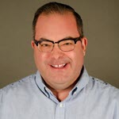

# OnRamp 2020 Agenda

This is what you can expect for your OnRamp week.
Your schedule includes attending keynotes and major events in the main conference.
You are also invited and encouraged to attend all evening social events.
These events are what makes this conference special.
Breaks are scheduled to coincide with the main conference so you will have opportunities to mingle and network.

## Attendance

It is expected that you will attend all OnRamp sessions.
You are __not__ permitted to jump back and forth between OnRamp and main conference sessions.
We have a lot of material to cover and we will be starting sessions on time.

## Course Material

We will be using the OnRamp Slack channel for communications.
If you have questions or comments that you don't feel comfortable asking during the day, please use this channel.
This is also a great way to network with other attendees.
Presentation material, including slides and sample code will be available on Github at [https://github.com/devops-collective-inc/OnRamp-2020](https://github.com/devops-collective-inc/OnRamp-2020).
You don't need a Github account to access the site.
You will able able to download a zip file from the site.

## Your Mentors

The OnRamp program has been developed with you in mind.
Guest speakers will present some material based on their expertise.
The remainder of your time will be spent with these mentors.

### Jeff Hicks

Jeff Hicks is one of the "old guard" of the PowerShell world.
He is one of the early  Microsoft PowerShell MVPs, a well-known author, conference speaker and teacher.
When he isn't writing PowerShell-related books or creating courseware for Pluralsight, you can find him walking the dog, doing a crossword puzzle and enjoying a nice glass of wine, bourbon or scotch.
Although, probably not all at the same time.
You can follow him on Twitter as [@JeffHicks](https://twitter.com/jeffhicks).
Jeff posts regularly at [https://jdhitsolutions.com/blog](https://jdhitsolutions.com/blog)

### Tim Warner

Timothy Warner is a Microsoft Most Valuable Professional (MVP) in Cloud and Datacenter Management who is based in Nashville, TN.
His professional specialties include Microsoft Azure, cross-platform PowerShell, and all things Windows server-related. You can reach Tim via Twitter as [@TechTrainerTim](https://twitter.com/techtrainertim).

### Michael Bender

Michael Bender is a teacher, community leader, and mentor within IT Pro community.
Currently, he builds content at Pluralsight around Azure, Microsoft 365, and PowerShell.
Besides technology, he enjoys helping others on their career journey.
On a personal side, he's an avid craft beer geek, Badger sports fan, and enjoys spending time with his family in Madison, WI.
You can follow him on twitter as [@MichaelBender](https://twitter.com/michaelbender).

### Michael Teske

Michael Teske is a life-long learner who enjoys helping others level up their career to achieve success.
After spending more than 17 years in the classroom, Michael now creates content for Pluralsight focusing mostly in the Azure space.
In his downtime, Michael can be found near his grills making BBQ and enjoying a Titos or walking his dog.
You can follow Michael on Twitter as [@Teskemj](https://twitter.com/teskemj).

## Agenda

Your agenda will consist of live presentations, open discussion and hands-on exercises.
This scheduled is always subject to change.

### Monday

| Schedule | Event |
|------:|------|
| 8:00-9:00 | *Breakfast* |
| 9:00-10:30 | __*PSSummit Sessions*__ |
| 10:30-11:00 | *Break* |
| 11:00-12:00 | __*PSSummit Sessions*__ |
| 12:00-1:00 | *Lunch* |
| 1:00-1:45 | __*PSSummit Sessions*__ |
| 2:00-2:45 | __OnRamp Welcome and Introductions__ (Jeff Hicks) |
| 2:45-3:15 | *Break* |
| 3:15-4:00 | __What Does It Mean to Have an IT Career Today?__ (Michael Bender) |
| 4:00-5:00 | __Automation and DevOps: An Intro to Concepts, Tools, and Technologies__ (Tim Warner) |
| 5:00 | *Welcome Reception* |

### Tuesday

|Schedule | Event |
|------:|------|
| 8:00-9:00   | *Breakfast* |
| 9:00-9:45   | __Introduction to Azure and Cloud Technologies__ (Tim Warner) |
| 9:45-10:30  | __Introduction to Containers__ (Anthony Nocentino) |
| 10:30-11:00 | *Break* |
| 11:00-12:00 | __IT Soft Skills__ (Michael Bender) |
| 12:00-1:00  | *Lunch* |
| 1:00-1:45   | __PowerShell 7 Fundamentals Crash Course__ (Jeff Hicks) |
| 1:45-2:00   | *Break* |
| 2:00-3:15   | __Objects in the Pipeline: Filtering, Grouping, Measuring, Formatting__ (Jeff Hicks) |
| 3:15-3:45   | *Break* |
| 3:45-5:00   | __PowerShell Lab and Review__ |

### Wednesday

|Schedule | Event |
|------:|------|
| 8:00-9:00   | *Breakfast* |
| 9:00-9:15   | __Review and Questions__ |
| 9:15-9:45   | __PowerShell: Providers and PSDrives__ (Michael Teske) |
| 9:45-10:30  | __PowerShell: Modules and PowerShellGet__ (Michael Teske) |
| 10:30-11:00 | *Break* |
| 11:00-12:00 | __PowerShell: Remoting__ (Michael Bender) |
| 12:00-1:00  | *Lunch* |
| 1:00-1:45   | __Getting Started with VS Code__ (Tim Warner) |
| 1:45-2:00   | *Break* |
| 2:00-2:45   |  __Introduction to PowerShell Scripting__ (Jeff Hicks) |
| 2:45-3:15   | *Break* |
| 3:15-4:00   | __Creating a Simple PowerShell Function__ (Jeff Hicks) |
| 4:00-4:15   | *Break* |
| 4:15-5:00   | __PowerShell Lab and Review__ |

### Thursday

|Schedule | Event |
|------:|------|
| 8:00-9:00   | *Breakfast* |
| 9:00-9:15   | __Review and Questions__ |
| 9:15-9:45   | __Creating PowerShell Modules__ (Jeff Hicks and Paula Kingsley) |
| 9:45-10:00  | *Break* |
| 10:00-10:45 | __Introduction to Pester__ (Missy Januszko) |
| 10:45-11:00 | *Break* |
| 11:00-12:00 | __Certification, Training, and Career Advancement__ (Michael Bender and Tim Warner) |
| 12:00-1:00  | *Lunch* |
| 1:00-1:45   | __PowerShell Scripting Exercise__ (Jeff Hicks) |
| 1:45-2:00   | __OnRamp Closing Remarks and Your Next Steps__ (Jeff Hicks, Tim Warner, and Michael Bender) |
| 2:00-4:00   | __*Iron Scripter and Closing Events*__ |

_last update February 10, 2020_
